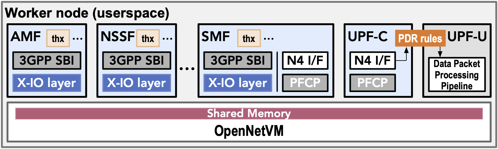

# [L<sup>2</sup>5GC<sup>+</sup> UPF][onvm-upf]

UPF in L<sup>2</sup>5GC<sup>+</sup> is developed on top of OpenNetVM, a high performance NFV platform based on [DPDK][dpdk] and [Docker][docker] containers.

The [next][next] branch tracks experimental builds (active development) whereas the [opensource][opensou] branch tracks verified stable releases.

## Design of UPF in L<sup>2</sup>5GC<sup>+</sup>



L<sup>2</sup>5GC<sup>+</sup> disaggregates the UPF into two complementary NFs: [UPF-C][upfc] and [UPF-U][upfu]. The UPF-C acts as the N4 interface endpoint that communicates with the SMF to receive and update PDR rules and user session contexts. UPF-C and UPF-U share the PDRs and user session state, residing in OpenNetVM's shared memory. As a result, the N4 communication overhead is minimized and UPF-U can access PDRs at minimal cost.
This disaggregation allows for rapid updates to PDRs and session state without impacting the user plane performance.

## Getting Started

We've provided two scripts to install required dependencies, and configure your machine to run OpenNetVM. Required dependencies are installed by [`scripts/install.sh`](/scripts/install.sh), and configuration is done by [`scripts/setup_runtime.sh`](/scripts/setup_runtime.sh).

From the `onvm-upf` folder, run the following two commands:

```text
./scripts/install.sh
```

```text
./scripts/setup_runtime.sh
```

> If you are using `Ubuntu 20.04`, you will need to perform [additional setup](./MANUAL_INSTALL.md#additional-setups-on-ubuntu-2004).

### Building

We use the [Meson][meson] build system to compile all components, including dpdk. From the `onvm-upf` parent folder run the following to setup build:

```text
source ~/.bashrc
./scripts/build.sh
```

This will take care of the Meson build setup, compilation, and installation of onvm shared libriaries.

Afterwards you may need to run the following comand to update the linker.

```text
ldconfig
```

### Running onvm_mgr

Bind NIC to `igb_uio` (replace `<pci_id>` | `<eth_if_id>` with the actual PCI address | eth interface ID)
```bash
sudo python <dpdk>/usertools/dpdk-devbind.py --bind=igb_uio <pci_id> | <eth_if_id>
```

You can use our provided [startup script](scripts/start.sh) to launch onvm_mgr. This scripts assumes the `onvm-upf` folder is your working directory.

```text
./scripts/start.sh  -k PORTMASK -n NF-COREMASK [-m MANAGER CORES] [-r NUM-SERVICES] [-d DEFAULT-SERVICE] [-s STATS-OUTPUT] [-p WEB-PORT-NUMBER] [-z STATS-SLEEP-TIME]
```

## Manual Installation
We provide step-by-step instructions for [manual installation](./MANUAL_INSTALL.md).

## Tested OS Distributions

| OS Distribution | Status                        | Notes                                                                                |
| --------------- | ----------------------------- | ------------------------------------------------------------------------------------ |
| Ubuntu 24.04    | ⚠️ Untested                   | All dependencies available via `apt` or `pip` |
| Ubuntu 22.04    | ✅ Works out of the box        | All dependencies available via `apt` or `pip`                                        |
| Ubuntu 20.04    | ✅ Works out of the box       | All dependencies available via `apt` or `pip`  |
| Ubuntu 18.04    | ⚠️ Untested                   | Likely requires upgrading GCC, Python, and installing recent Meson manually |

---

## Dependency Versions

| Component       | Version          | Installation Notes                               |
| --------------- | ---------------- | ------------------------------------------------ |
| **DPDK**        | `24.07.0`        | Built from source using Meson                    |
| **Pktgen-DPDK** | `24.07.0`        | Compatible with the same DPDK version            |
| **dpdk-kmods**  | `commit@9b182be` | Required only for `igb_uio` (optional)           |
| **Meson**       | `>=0.58.0`       | Recommended: `0.61.2+`; use `pip3 install meson` |
| **Ninja**       | `>=1.10.0`       | Usually installed via `apt`                      |

---

[onvm-upf]: https://github.com/nycu-ucr/onvm-upf
[opensou]: https://github.com/nycu-ucr/onvm-upf/tree/opensource
[next]: https://github.com/nycu-ucr/onvm-upf/tree/next
[upfc]: 5gc/upf_c/
[upfu]: 5gc/upf_u/
[license]: LICENSE
[dpdk]: http://dpdk.org
[docker]: https://www.docker.com/
[examples]: https://opennetvm.readthedocs.io/en/develop/examples/index.html
[docker-nf]: https://opennetvm.readthedocs.io/en/develop/docker/index.html
[rels]: docs/Releases.md
[meson]: https://mesonbuild.com/
